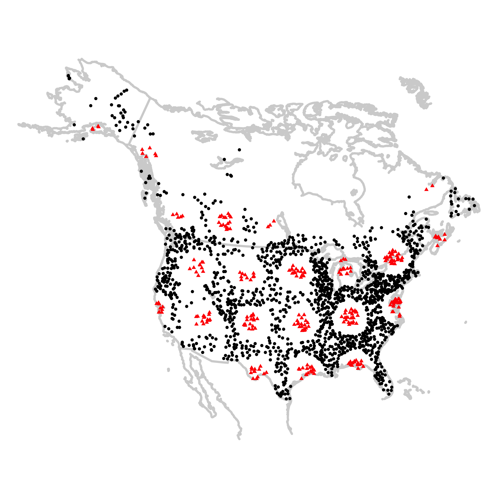
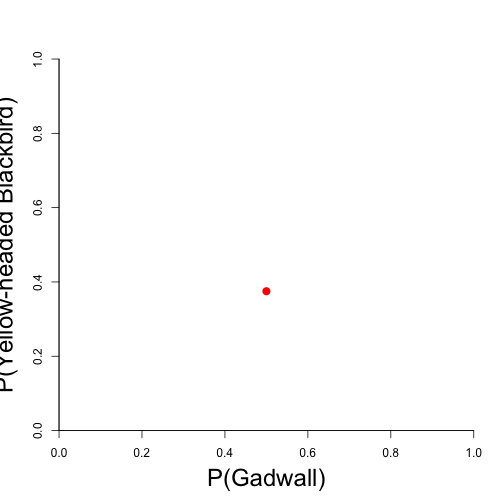
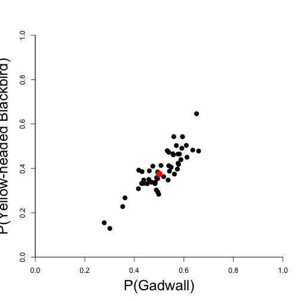

Predicting species composition with a multiscale model
========================================================
author: David J. Harris
date: ESA 2013
transition: none
Practice talk for Teary group

Underlying questions:
========================================================

- What species will we find in unexplored conditions?
- Which species can co-occur?
- Which ecological theories and processes can explain what we observe?

 

##  

Underlying questions:
========================================================

- What species will we find in unexplored conditions?
- Which species can co-occur?
- Which ecological theories and processes can explain what we observe?

 

## What's missing: general-purpose methods for generating realistic species assemblages

========================================================
incremental: true

## - General-purpose method
* Applicable across systems and taxa

## - Out-of-sample accuracy
* Mimics the data-generating processes

## - Distribution of possible outcomes
* e.g. confidence intervals

## - "Mechanistic" interpretation
* Can specify ecological hypotheses using model structure 
* Can build in ecological knowledge from other sources

One common approach to modeling assemblages:
========================================================
incremental: true
## "Stacks" of single-species distribution models
* Species aren't independent
  * Multiple species may respond to the same factors
  * Species may interact with one another
* Spend degrees of freedom re-learning each species' response to the environment

## Single-species models can't assess co-occurrence

========================================================
incremental: true
# Species Assemblage Models (SAMs)
 

## Input: environmental data for a site (if available)

 

## Output: likely species compositions for that site

// My Standard Diagram
========================================================
X-->Z-->Y

========================================================
* Choose model form (e.g. decision trees or neural nets)
* Optimize the model's log-probability of generating the observed data

Adding constraints on co-occurring species pairs
========================================================
[[add arrows to diagram from previous slide]]

========================================================
left: 20%

* Breeding Bird Survey
* Worldclim climate data

****

Allowing for unobserved environmental drivers
========================================================
<small>(currently in review at PNAS)</small>

 

Allowing for unobserved environmental drivers
========================================================
<small>(currently in review at PNAS)</small>

 

Allowing for unobserved environmental drivers
========================================================
<small>(currently in review at PNAS)</small>

Allowing for unobserved environmental drivers
========================================================
<small>(currently in review at PNAS)</small>

**Top 30 species:** Sora, American Coot, Redhead, Ruddy Duck, Northern Shoveler, Yellow-headed Blackbird, Gadwall, Blue-winged Teal, Canvasback, Ring-necked Duck, Bufflehead, Marsh Wren, Lesser Scaup, American Bittern, Nelson's Sparrow, Willet, Black-crowned Night-Heron, American White Pelican, American Wigeon, Canada Goose, Wilson's Snipe, Wilson's Phalarope, Common Goldeneye, Northern Pintail, Green-winged Teal, Cinnamon Teal, American Avocet, Le Conte's Sparrow, Double-crested Cormorant, Wood Duck

2013: Adding random effects
========================================================
* Nested sampling designs:
  * Stops along a transect
  * Quadrats within a site
* Two easy, but suboptimal options:
  * Could treat fine-scale samples as independent
  * Could ignore fine-scale data
* Random effects:
  * ???

Contributions (1):
========================================================
* Better species-level predictions (especially for rare species)
* Confidence intervals
* One-to-many mapping
* Summarize environment from taxon's perspective
  * Inferences about unmeasured variables

Contributions (2):
========================================================
* Accommodates multiple sources of information
  * Partial observations
	* Nearby observations
	* Species similarities
* Model structure can mirror ecological theory

Contributions (3):
========================================================
* 312 species distribution models in 60 seconds

